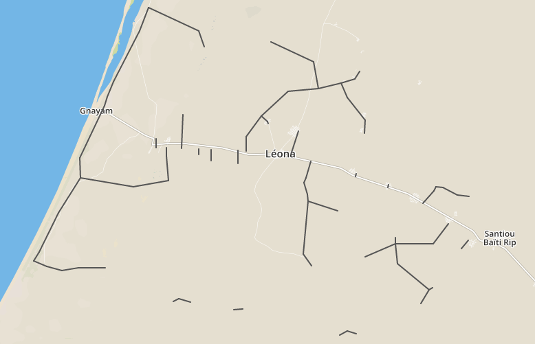
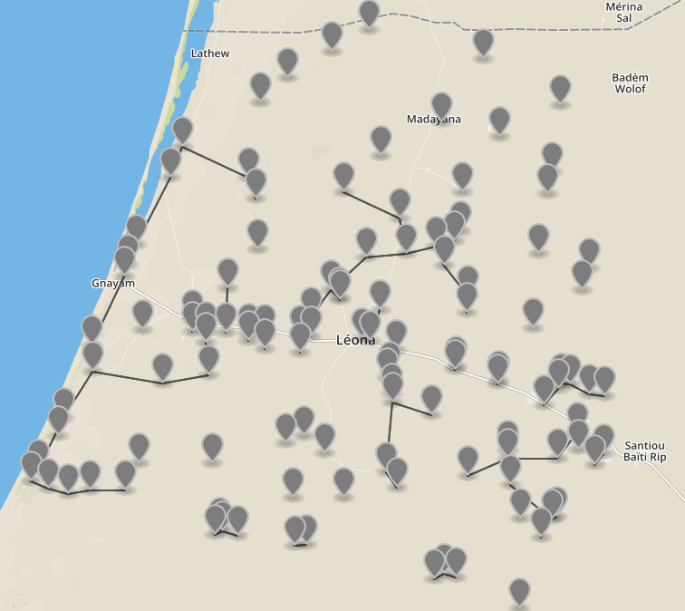

# GeoGraph composition

The networker library extends the [networkx](https://github.com/networkx) `compose` functionality to spatial networks (GeoGraphs).  Composition is similar to a graph union operation. 

In combination with networkers `merge_nearby_nodes` function, `compose` can be used as a spatial join of networks.  

## Python Demo

Below is a python session demonstrating the fundamental GeoGraph compose functionality.

```python
import networker.io as nio
from networker.classes.geograph import GeoGraph
from networker import utils
%matplotlib inline

# Setup left and right GeoGraphs to be composed
left_coords = [[0, 0], [100, 0], [200, 50]]
left_edges = [(0, 1), (1, 2)]
right_coords = [[0, 10], [50, 50]]

# create geographs and assign node attributes
left = GeoGraph(coords=left_coords, data=left_edges)
left.node = {node: {'name': ("L%s" % node)} for node in range(3)}
right = GeoGraph(coords=right_coords)
right.node = {node: {'name': ("R%s" % node)} for node in range(2)}

print("left geograph nodes:  %s" % len(left.nodes()))
print("right geograph nodes:  %s" % len(right.nodes()))
```

    left geograph nodes:  3
    right geograph nodes:  2


```python
# union the left and right graphs forcing them to be disjoint prior
# to the union (so the 3 nodes in left and 2 nodes in right should result in 5)
unioned_disjoint = GeoGraph.compose(left, right, force_disjoint=True)

print("unioned_disjoint nodes:  %s" % len(unioned_disjoint.nodes()))
utils.draw_geograph(unioned_disjoint, node_label_field="name", node_size=400)
```

    unioned_disjoint nodes:  5


```python
# union the graphs without forcing them to be disjoint first
# nodes 0 and 1 from left are merged with nodes 0 and 1 from right
# and the right nodes attributes/coordinates take precedence
unioned = GeoGraph.compose(left, right)

print("unioned nodes:  %s" % len(unioned.nodes()))
utils.draw_geograph(unioned, node_label_field="name", node_size=500)
```

    unioned nodes:  3


```python
# now merge the nodes from the disjoint graph based on a proximity
# radius and see that L0 and R0 are merged (with R0 attributes taking precedence)
disjoint_merged = GeoGraph.compose(left, right, force_disjoint=True)
disjoint_merged.merge_nearby_nodes(radius=10)

print("disjoint merged nodes:  %s" % len(disjoint_merged.nodes()))
utils.draw_geograph(disjoint_merged, node_label_field="name", node_size=500)
```

    disjoint merged nodes:  4


## Compose Command Line Tool Demo

The `compose` command line tool can be used to compose multiple network datasets in various formats, merge their nodes based on proximity and output them as shapefiles or geojson. 

This is demonstrated below as we merge the demand nodes csv and the proposed network shapefile into a geojson file.  

### compose as format converter

To translate from from csv, shp, geojson to shp or geojson you can use the compose script.  Just specify a single input file and the desired output file with the appropriate extensions.  

Note that there's a really nice geojson viewer+ by mapbox [here](http://geojson.io).

```bash
(networker-rel-4.0)[cjn@cjn-debian networker]$ compose.py data/leona/expected/metrics-local-short.csv metrics-local-short.geojson
2016-07-15 15:54:22,469 - networker - INFO - networker 0.3.0 (Python 2.7.12)
2016-07-15 15:54:22,494 - networker - INFO - filename data/leona/expected/metrics-local-short.csv, nodes: 102, edges: 0
2016-07-15 15:54:22,494 - networker - INFO - output nodes: 102, edges: 0
```


Convert network shapefile to geojson

```bash
(networker-rel-4.0)[cjn@cjn-debian networker]$ compose.py data/leona/expected/networks-proposed.shp networks-proposed.geojson
2016-07-15 16:08:28,157 - networker - INFO - networker 0.3.0 (Python 2.7.12)
2016-07-15 16:08:28,168 - networker - INFO - filename data/leona/expected/networks-proposed.shp, nodes: 88, edges: 70
2016-07-15 16:08:28,169 - networker - INFO - output nodes: 88, edges: 70
```



Now try merging them.  Note the following command-line args:
- --force_disjoint:  Forces the input nodes to be disjoint before merging (ensuring that the resulting composition is disjoint)
- --match_radius:  Applied after the composition is performed, this merges any nodes within the radius of eachother.  

```bash
(networker-rel-4.0)[cjn@cjn-debian-work networker]$ compose.py --force_disjoint --match_radius 0.00001 data/leona/expected/metrics-local-short.csv data/leona/expected/networks-proposed.shp merged.geojson
2016-07-15 16:16:40,866 - networker - INFO - networker 0.3.0 (Python 2.7.12)
2016-07-15 16:16:40,891 - networker - INFO - filename data/leona/expected/metrics-local-short.csv, nodes: 102, edges: 0
2016-07-15 16:16:40,900 - networker - INFO - filename data/leona/expected/networks-proposed.shp, nodes: 88, edges: 70
2016-07-15 16:16:41,023 - networker - INFO - output nodes: 115, edges: 68
```

In the above case, the data is in long/lat format and so a match radius of 0.00001 decimal degrees is roughly 1.11 meters at the equator.  Also note that the resulting geojson would have had 190 nodes had we not specified the `match_radius`.  



